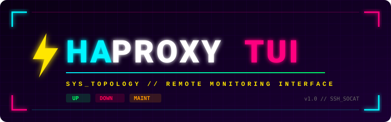

<p align="center">
  
</p>

# haproxyTUI

`haproxyTUI` is a Cyberpunk-themed Terminal User Interface (TUI) written in Go for monitoring and managing HAProxy backend instances remotely over SSH. Built on top of the [Charm](https://charm.sh/) ecosystem (`bubbletea` and `lipgloss`), it provides real-time visibility into server topology and status with quick keybindings to toggle server availability.

## ⚡ Features

* **Native SSH & SSH Config Resolution**: Reads `~/.ssh/config` to resolve SSH host aliases, identity files, ports, and usernames. Supports SSH agent authentication out of the box.
* **Dynamic Socket Discovery**: Automatically locates the active HAProxy stats socket path from `/etc/haproxy/haproxy.cfg` on the remote target host.
* **Cyberpunk Visual Styling**: Fullscreen interface with color-coded status badges (`UP`, `DOWN`, `MAINT`, `DRAIN`), full-row selection highlighting, and expanded column spacing.
* **Automatic Sorting**: Multi-level alphabetical sorting (first by Backend name, then by Server name).
* **Live Auto-Refresh**: Visual 10-second countdown timer that automatically refreshes statuses in the background.
* **Instant Action Keys**: Toggle server states (`enable` / `disable`) with single keypresses.

## 🏗️ Prerequisites

* **Go**: `1.20` or higher (if building from source).
* **Remote HAProxy Server**:
  * SSH access with key-based public key authentication.
  * Installed `socat` utility.
  * Sudo access for `awk` and `socat` commands to interact with the HAProxy socket file.

## 🚀 Build & Installation

```bash
# Clone the repository
git clone https://github.com/chrisvanmeer/haproxy-tui.git
cd haproxy-tui

# Install dependencies
go mod download

# Build binary
go build -o haproxyTUI main.go
```

## ⚙️ Usage

Launch the binary by specifying an SSH host alias, IP, or `user@host` combination:

```bash
# Connect using an SSH config alias
./haproxyTUI ha01

# Connect using explicit user and host
./haproxyTUI admin@192.168.1.50
```

## ⌨️ Keyboard Shortcuts

| Shortcut       | Action                                                  |
| -------------- | ------------------------------------------------------- |
| `↑` / `k`      | Move cursor up                                          |
| `↓` / `j`      | Move cursor down                                        |
| `e`            | **Enable** selected server member                       |
| `d`            | **Disable** selected server member                      |
| `r`            | Force **Refresh** status immediately (resets countdown) |
| `q` / `Ctrl+C` | Exit application                                        |

## CI/CD Pipeline (GitHub Actions)

This project uses two GitHub Actions workflows to automate testing and releases:

* **Continuous Integration (`ci.yml`)**: Automatically runs on every push to the `main` branch to execute code linting and unit test suites.
* **Build & Release (`release.yml`)**: A manual workflow (`workflow_dispatch`) that can be triggered from the Actions tab. This workflow builds the application binaries and publishes them to GitHub Releases.

## 📄 License

MIT License. Free for personal and commercial use.

## 👤 Author

Chris van Meer - <chris@atcomputing.nl>
